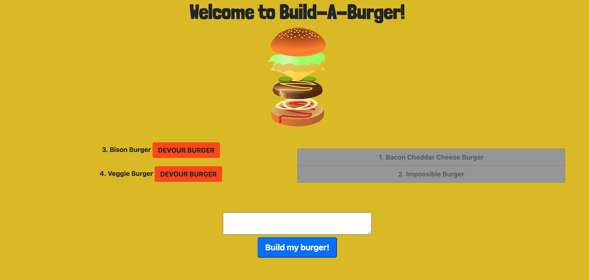

# Build-A-Burger

## Description

This is a restaurant app that emulates the experience of building and then devouring a burger. It was created using the MVC paradigm, and holds all information in a MySQL database. 

## Table of Contents

* [Link](#link)
* [Usage](#usage)
* [Credits](#credits)
* [Questions](#questions)
* [License](#license)

## Link

Heroku deployed application:
https://blooming-plains-91984.herokuapp.com/

## Usage

When you navigate to the page, there will be a textarea that you can use to build your burger. When you hit "Build my burger!", the burger will be created and placed on the left side of the screen, along with a 'DEVOUR BURGER' button. If you press this button, the burger will be moved to the right side of the screen, indicating that it has been devoured. 

## Credits

First I must credit the UCLA Extension Full-Stack Web Development Coding Bootcamp, instructor Bryan Swarthout, and TA Wilson Lam for providing me with all of the tools and knowledge I used to build this application.

http://www.uclaextension.edu

The npm package "Express" was used to create the server.

https://expressjs.com/

Heroku was used to host the website for deployment.

https://www.heroku.com

MySQL Workbench was used to create the database.

https://www.mysql.com/products/workbench/

The npm packages 'mysql' was used to connect and interact with the database.

https://www.npmjs.com/package/mysql

The npm package 'Express Handlebars' was used to create the HTML.

https://www.npmjs.com/package/express-handlebars

The npm package "dotenv" was used to configure my connection data with Heroku.

https://www.npmjs.com/package/dotenv

The favicon was created using favicon.io.

https://favicon.io/

I pulled the font 'Londrina Solid' from Google Fonts.

https://fonts.google.com/

The program 'Jaws_DB' was used to send my database to Heroku.

https://www.jawsdb.com/

## Questions

For any questions, I, DJ Hersh, can be contacted via email at DanielJHersh@gmail.com

My GitHub profile is located at https://github.com/DJ620

## License

MIT License

Copyright (c) [2020] [DJ Hersh]

Permission is hereby granted, free of charge, to any person obtaining a copy
of this software and associated documentation files (the "Software"), to deal
in the Software without restriction, including without limitation the rights
to use, copy, modify, merge, publish, distribute, sublicense, and/or sell
copies of the Software, and to permit persons to whom the Software is
furnished to do so, subject to the following conditions:

The above copyright notice and this permission notice shall be included in all
copies or substantial portions of the Software.

THE SOFTWARE IS PROVIDED "AS IS", WITHOUT WARRANTY OF ANY KIND, EXPRESS OR
IMPLIED, INCLUDING BUT NOT LIMITED TO THE WARRANTIES OF MERCHANTABILITY,
FITNESS FOR A PARTICULAR PURPOSE AND NONINFRINGEMENT. IN NO EVENT SHALL THE
AUTHORS OR COPYRIGHT HOLDERS BE LIABLE FOR ANY CLAIM, DAMAGES OR OTHER
LIABILITY, WHETHER IN AN ACTION OF CONTRACT, TORT OR OTHERWISE, ARISING FROM,
OUT OF OR IN CONNECTION WITH THE SOFTWARE OR THE USE OR OTHER DEALINGS IN THE
SOFTWARE.